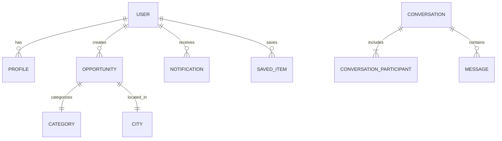

# 🤝 Buluş

> **Çevren yoksa, çevreni oluştur.**

Buluş; insanların yalnızca ilan listeleri arasında kaybolması yerine, birbirleriyle gerçek **fırsatlar** ve **ihtiyaçlar** üzerinden doğrudan bağlantı kurmasını sağlayan insan ve fırsat odaklı bir sosyal ağ platformudur.

---

## 🎯 Vizyon & Ürün İlkeleri

Buluş, özellikle öğrenciler, yeni mezunlar ve fırsatlara erişimi kısıtlı bireyler için networking engellerini ortadan kaldırmayı hedefler:

- 👥 **İnsan ve Fırsat Merkezli:** Şirket reklamları ve kurumsal gürültüden uzak, doğrudan insan-insan etkileşimi.
- 🌐 **Demokratik Erişim:** Küçük şehirlerdeki ve çevresi kısıtlı yeteneklerin fırsatlara erişimini kolaylaştırma.
- 🎯 **Gerçek İhtiyaçlar:** Vanity metric'ler (beğeni/takipçi avı) yerine somut eşleşmeler ve yardımlaşma.
- 💬 **Düşük Gürültü:** İş, staj, mentorluk, proje arkadaşı, tez araştırması veya kullanıcı testi gibi spesifik odak noktaları.

---

## 🛠️ Teknoloji Yığını

### **Frontend**
- **Framework:** Next.js (React / TypeScript)
- **Stil & Animasyon:** Tailwind CSS, Framer Motion
- **İkonlar:** Lucide React

### **Backend & Veritabanı**
- **Platform:** .NET Core (ASP.NET Core Web API)
- **Mimari:** Clean Architecture (Domain, Application, Infrastructure, API)
- **ORM:** Entity Framework Core (PostgreSQL / Supabase)
- **Kimlik Doğrulama:** Supabase Auth & JWT Bearer Token

---

## 🏗️ Proje Mimarisi

Backend, Clean Architecture prensiplerine uygun olarak katmanlara ayrılmıştır:

```text
Bulus/
├── bulus-backend/               # .NET Core Backend Solution
│   ├── src/
│   │   ├── Bulus.Domain/        # Entity'ler, Enums, Value Object'ler
│   │   ├── Bulus.Application/   # Use Case'ler, DTO'lar, Interfaces
│   │   ├── Bulus.Infrastructure/# EF Core, Supabase Auth, Repositories
│   │   └── Bulus.API/           # Web API Controllers, Middleware, Filters
│   └── tests/
│       ├── Bulus.Domain.Tests/
│       └── Bulus.Application.Tests/
│
└── src/                         # Next.js Frontend App
    ├── app/                     # Next.js App Router (Sayfalar & Route'lar)
    ├── components/              # UI Component'leri (UI, Navigation, Brand)
    ├── context/                 # React State & Context (ThemeContext vb.)
    └── types/                   # TypeScript Tip Tanımlamaları
```

### Katman Bağımlılık Yönü
Domain ⟵ Application ⟵ Infrastructure ⟵ API

> 💡 *Domain ve Application katmanları harici bağımlılıklardan tamamen izoledir. Supabase ve veritabanı entegrasyonları yalnızca Infrastructure katmanında yönetilir.*

---

## 🧠 Domain Modeli



### Fırsat (Opportunity) Türleri
- 💼 **Job** (İş)
- 🎓 **Internship** (Staj)
- 🚀 **Project** (Proje Katılımı)
- 🤝 **Mentorship** (Mentorluk)
- 👥 **TeamMember** (Ekip Arkadaşı)
- 🧪 **UserTesting** (Kullanıcı Testi)
- 📚 **ThesisResearch** (Tez / Akademik Araştırma)
- 📖 **Education** (Eğitim / Atölye)

---

## 🔐 Authentication Akışı

Kimlik doğrulama işlemleri **Supabase Auth** üzerinden yürütülür ve JWT ile API güvenliği sağlanır:

```text
Frontend (Next.js) ──(Supabase Auth)──> Supabase Services
       │                                     │
       │ (JWT Token)                         │ (Auth UUID)
       ▼                                     ▼
 ASP.NET Core API ──(CurrentUserService)──> PostgreSQL DB
```

1. Kullanıcı Frontend üzerinden Supabase ile giriş yapar.
2. Elde edilen JWT Bearer token ile API'ye istek gönderilir.
3. API, `CurrentUserService` vasıtasıyla `sub` talebinden (Supabase UUID) kullanıcıyı doğrular ve kendi veritabanındaki `User` varlığı ile eşleştirir.

---

## 🚀 Yerel Geliştirme (Local Development)

### Ön Gereksinimler
- [.NET SDK](https://dotnet.microsoft.com/)
- [Node.js](https://nodejs.org/) & npm
- PostgreSQL veya Supabase Hesabı

### 1. Backend'i Çalıştırma
```bash
# Backend dizinine geçin
cd bulus-backend

# Bağımlılıkları yükleyin ve projeyi derleyin
dotnet restore
dotnet build

# User Secrets ile veritabanı bağlantısını tanımlayın
dotnet user-secrets set "ConnectionStrings:DefaultConnection" "YOUR_POSTGRESQL_CONNECTION_STRING" --project src/Bulus.API/Bulus.API.csproj

# API'yi başlatın
dotnet run --project src/Bulus.API
```
> API başladığında Swagger UI üzerinden endpoint'leri test edebilirsiniz.

### 2. EF Core Veritabanı Güncellemeleri
```bash
# Yeni Migration ekleme
dotnet ef migrations add <MigrationName> --project src/Bulus.Infrastructure --startup-project src/Bulus.API --output-dir Persistence/Migrations

# Veritabanını güncelleme
dotnet ef database update --project src/Bulus.Infrastructure --startup-project src/Bulus.API
```

### 3. Frontend'i Çalıştırma
```bash
# Kök dizinde bağımlılıkları yükleyin
npm install

# Geliştirme sunucusunu başlatın
npm run dev
```

---

## 🛣️ Yol Haritası (Roadmap)

- [x] Clean Architecture Backend kurulumu (.NET)
- [x] Domain modeli & EF Core yapılandırması
- [x] Supabase PostgreSQL entegrasyonu
- [x] JWT Authentication & Swagger entegrasyonu
- [x] Next.js Frontend temel UI / Sayfa tasarımları
- [ ] Auth & Onboarding uçtan uca akışı
- [ ] Opportunity CRUD ve Filtreleme / Keşfet API'leri
- [ ] Anlık Mesajlaşma (Realtime Messaging)
- [ ] Bildirim Sistemi & Kaydedilenler
- [ ] Admin Paneli & Yetkilendirme

---

## 🔒 Güvenlik Notu

Depoya kesinlikle hassas bilgiler (**Database parolaları**, **Supabase secret key'leri**, **JWT secret'ları**, **.env dosyaları**) commit edilmemelidir. Geliştirme ortamında **User Secrets**, canlı ortamda ise ilgili platformun **Environment Variables** mekanizması tercih edilmelidir.

---

## 📄 Lisans

Bu proje geliştirme aşamasındadır. Lisans şartları ilerleyen süreçte netleştirilecektir.